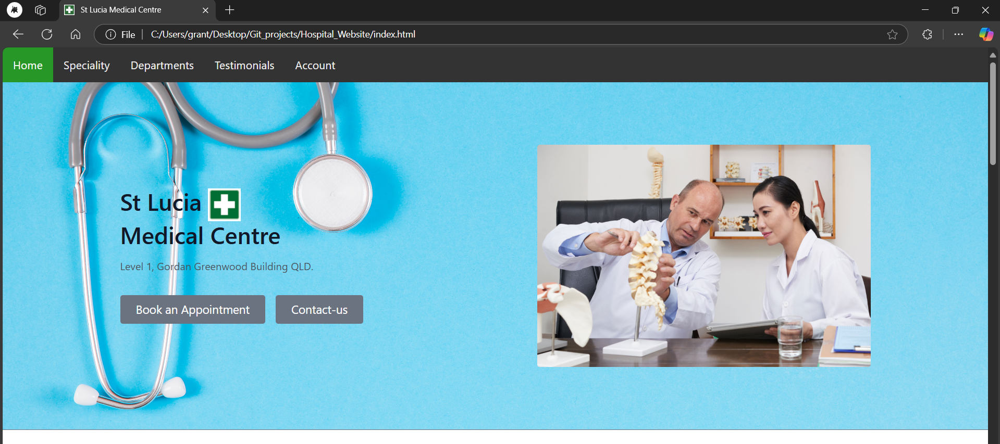
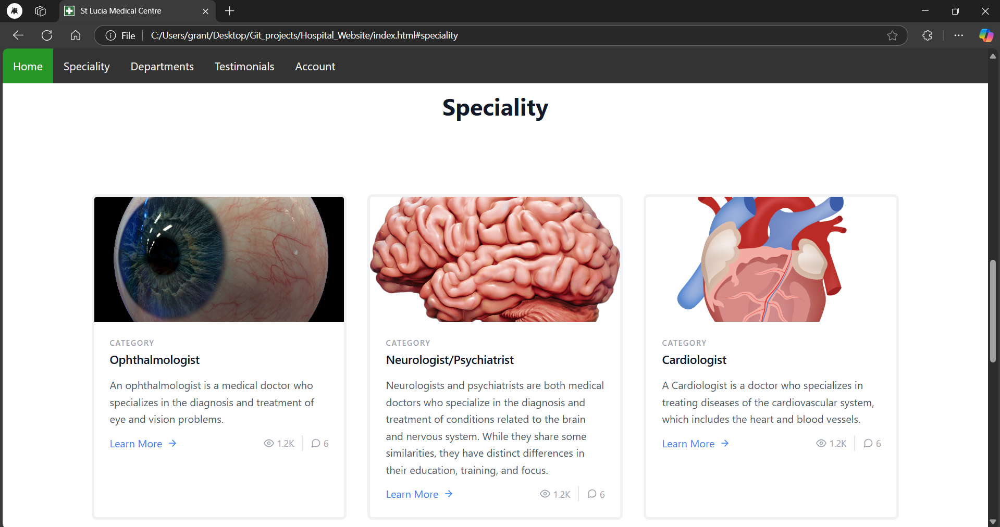
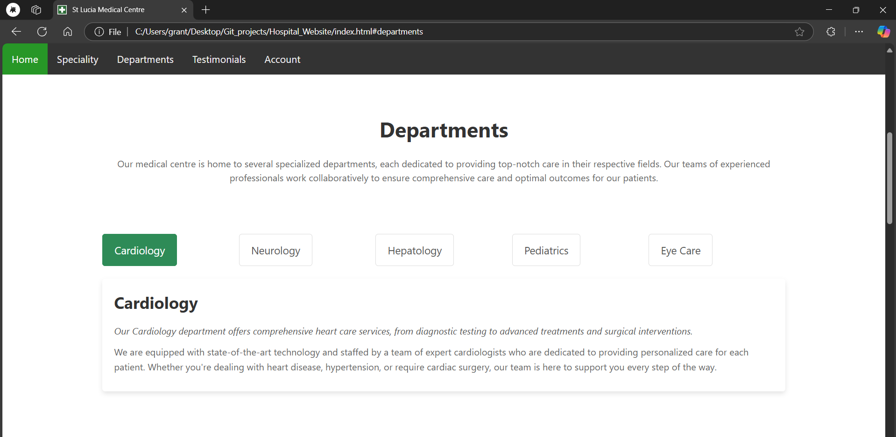
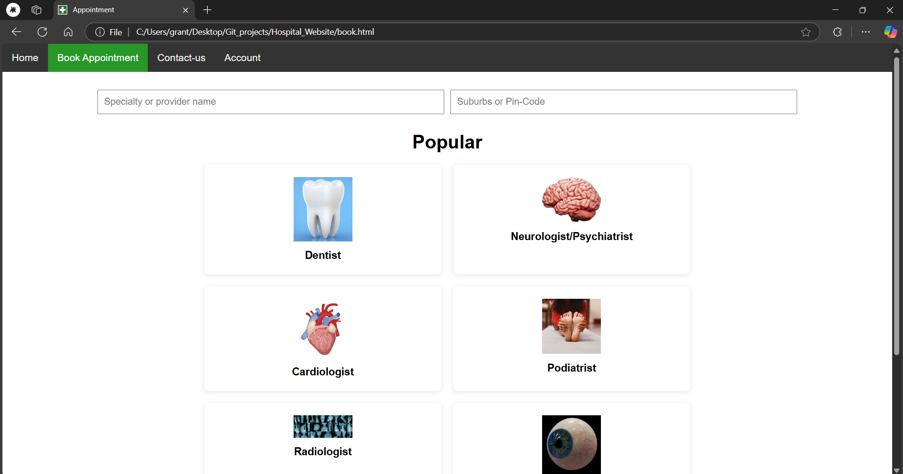
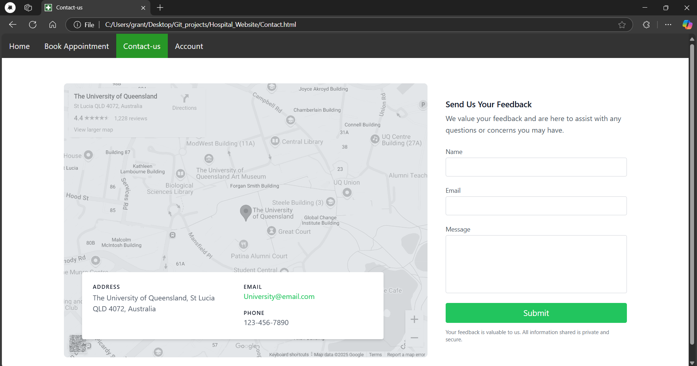
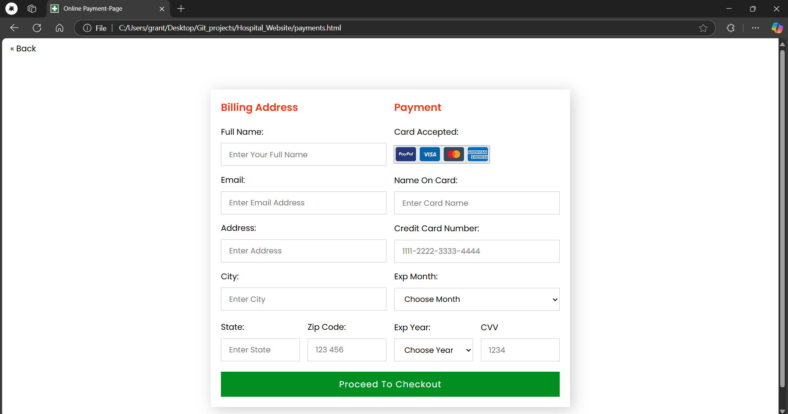
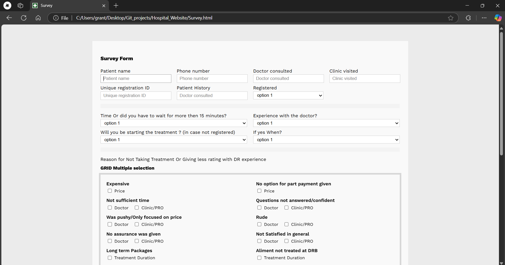

# St Lucia Medical Centre Website

> 📸 Screenshots of the website are available at the bottom of this README.

A modern, responsive hospital website built with HTML, CSS, and JavaScript, featuring a comprehensive healthcare management system.

## 🌟 Features

### Core Functionalities
- **Interactive Department Showcase**
  - Detailed department information
  - Visual representation of specialties
  - Easy navigation between departments

- **Appointment Booking System**
  - Online appointment scheduling
  - Department-based booking
  - Time slot management

- **User Management**
  - Secure login system
  - Profile management
  - Account customization

- **Patient Feedback System**
  - Testimonials showcase
  - Survey collection
  - Rating system

- **Payment Processing**
  - Secure payment gateway
  - Transaction management
  - Payment history

## 🛠️ Tech Stack

### Frontend
- **HTML5** - Semantic markup and structure
- **CSS3** - Styling and animations
- **JavaScript** - Interactive functionality
- **Tailwind CSS** - Utility-first CSS framework
- **Font Awesome** - Icon library

### Key Libraries & Tools
- **Tailwind CSS** - For responsive design and utility classes
- **Font Awesome** - For beautiful icons
- **Custom CSS** - For specialized styling
- **Vanilla JavaScript** - For dynamic functionality

## 📱 Responsive Design
- Mobile-first approach
- Adaptive layouts for all devices
- Touch-friendly navigation
- Optimized images and assets

## 🚀 Project Structure
```
Hospital_Website/
├── css/
│   ├── account.css
│   ├── book.css
│   ├── department.css
│   ├── login.css
│   ├── nav.css
│   ├── payments.css
│   ├── profile.css
│   ├── style.css
│   └── Survey.css
├── js/
│   ├── alert.js
│   ├── department.js
│   ├── login.js
│   ├── nav.js
│   ├── payments.js
│   └── script.js
├── websiteimages/
├── account.html
├── book.html
├── Contact.html
├── index.html
├── login.html
├── payments.html
├── profile.html
└── Survey.html
```

## 🎨 Design Highlights
- Modern and professional UI
- Consistent color scheme
- Intuitive navigation
- Engaging user experience
- Accessibility considerations

## 🔒 Security Features
- Form validation
- Secure payment processing
- Protected user data
- Input sanitization

## 🎯 Key Pages
1. **Home Page** - Welcome and department overview
2. **Booking System** - Appointment scheduling
3. **Account Management** - User profiles and settings
4. **Contact Page** - Communication channels
5. **Survey System** - Patient feedback collection
6. **Payment Processing** - Secure transactions

## 💡 Future Enhancements
- [ ] Online chat support
- [ ] Appointment reminders
- [ ] Blog/News section
- [ ] Advanced search functionality
- [ ] Multi-language support
- [ ] Integration with healthcare APIs

## 🚀 Getting Started

### Prerequisites
- Modern web browser
- Basic understanding of HTML, CSS, and JavaScript

### Installation
1. Clone the repository
```bash
git clone https://github.com/yourusername/Hospital_Website.git
```

2. Open the project directory
```bash
cd Hospital_Website
```

3. Open `index.html` in your browser

## 🤝 Contributing
Contributions are welcome! Please feel free to submit a Pull Request.

## 🙏 Acknowledgments
- University of Queensland for inspiration
- All contributors and supporters
- Open source community

---

<div align="center">
  <h3>Connect with me:</h3>
  <p>
    <a href="https://github.com/yourusername" target="_blank">
      
    </a>
    <a href="https://www.linkedin.com/in/yourusername" target="_blank">
      
    </a>
  </p>
</div>

---

## 📸 Screenshots

### Landing Page


### Specialties Section


### Departments


### Testimonials


### Appointment Booking


### Contact Us


### Payment Page


### Survey Form
 